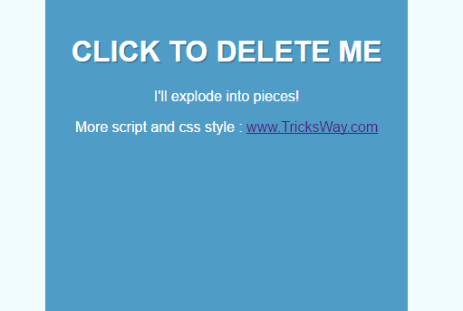

# Blocks Expending Effect

First design looks as a simple wall but Blocks explode when it’s clicked or touched, mainly using CSS and jquery and thought that was really cool. This is a awesome example of Jquery and JavaScript.
  

 
 
<a href="https://www.tricksway.com/blocks-expending-effect-using-css-and-jquery-for-website-and-blog/"> https://www.tricksway.com/blocks-expending-effect-using-css-and-jquery-for-website-and-blog/</a>
